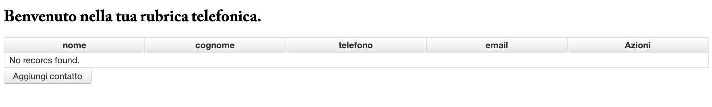
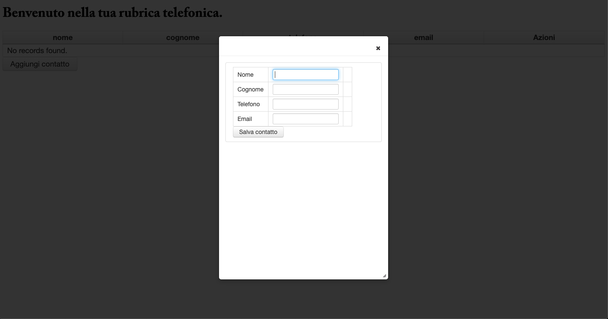
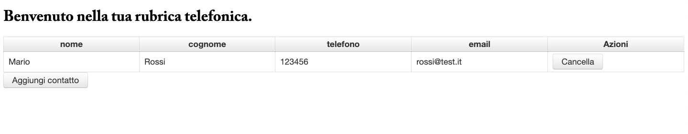

# Rubrica2.0 📚

Progetto e sviluppo di una rubrica telefonica in Java.

## Tecnologie usate:
- Java 8
- JavaServer Faces (JSF)
- PrimeFaces Framework
- Enterprise JavaBeans (EJB)
- Java Persistence API (JPA)
- MySQL
- TomEE (TomCat)

### **Come funziona**

Ho diviso lo sviluppo del progetto in 3 parti seguendo circa il pattern MVC; quindi una parte di view, una di business e una di model. 

#### **Parte di view:**  
Ho un file home.xthml che mi rappresenta la parte front-end dell'applicazione.  
Ho utilizzato JSF, un framework di JavaEE per lo sviluppo lato presentation; ho aggiunto PrimeFaces, una suite di componenti aggiuntive basata su JSF per perfezionare la grafica della mia web app.   
Successivamente ho creato un ManagedBean il cui all'interno sono presenti i metodi "cliccabili", come salvaContatto o cancellaContatto i quali mi serviranno per collegarmi alla parte di business. 
_Link: https://www.primefaces.org/_  

#### **Parte di Business:**
Ho implementato la logica di business tramite gli EJB (Enterprise JavaBeans).  
Nello specifico ho un RubricaBean il quale mi implementa le interfacce RubricaLocal e RubricaRemote e dove all'interno vi sono i metodi effettivi che mi fanno interagire sia con il ManagedBean sia con la parte di model.

#### **Parte di Model:**
Ho un file Contatto che mi rappresenta la tabella presente e creata precedentemente in MySQL.  
Dopo aver settato tutti i campi (Primary Key, AI, NotNull ecc..) ho creato l'entity Contatto con all'interno l'annotation @Column per ogni campo presente. 

_Dopo aver configurato tutti i parametri correttamente, sia lato Database che lato Server, la web application è pronta all'uso_.

Esempi:

  

  

  

